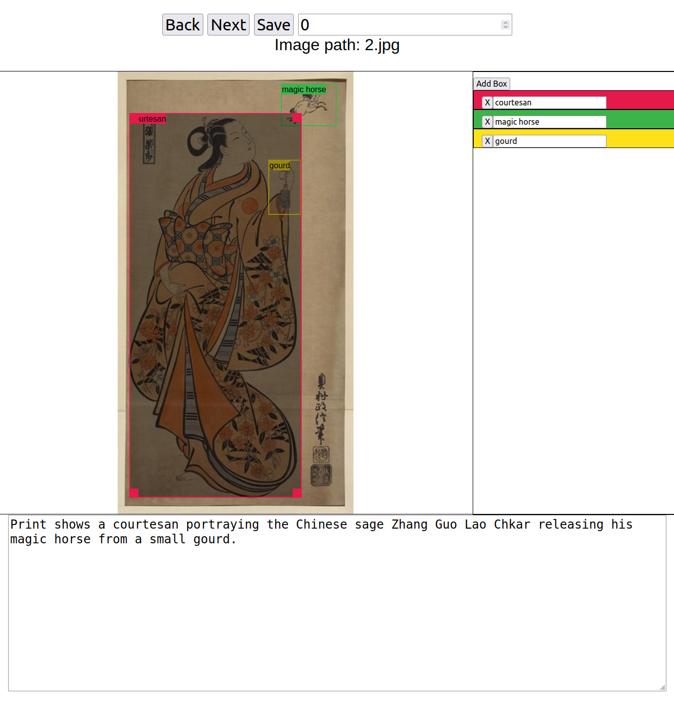

# Box Annotator

Simple annotation tool for bounding boxes in images that also enables pre-annotations (for example from a object detection model) to be loaded and corrected. No classes are required and also enables editing of image captions, allowing for creating annotations for visual grounding models.

### Installation
The only prerequisites for runnning the tool are `python` and `flask`. Furthermore, the tool requires a hosted image library. To host a library on localhost simply run `python -m http.server 8080` in the directory containing your images.

### Configuration
`app.py` expects an `INPUT_FILE` and an `OUTPUT_FILE` (both variables in `app.py`), which can be the same file. The input file must be a JSON file which contains a list of dictionaries where each list entry represents the pre-annotations for a single image. Each entry must follow the following key-value strcuture:
- `boxes`: list of bounding boxes in `xywh` format, relative to the image size (i.e. between 0 and 1). May be empty list.
- `phrases`: list of bounding box labels, matching in index to the `boxes` list. May be empty list.
- `caption`: string containing description of the image. May be empty string.
- `image_path`: URI of the image which lives within the hosted image library.

`static/js/script.js` contains a global variable `imageUrl` which points to the root URL of the hosted image library.

### Running the tool
Run `python app.py` to launch the tool.
